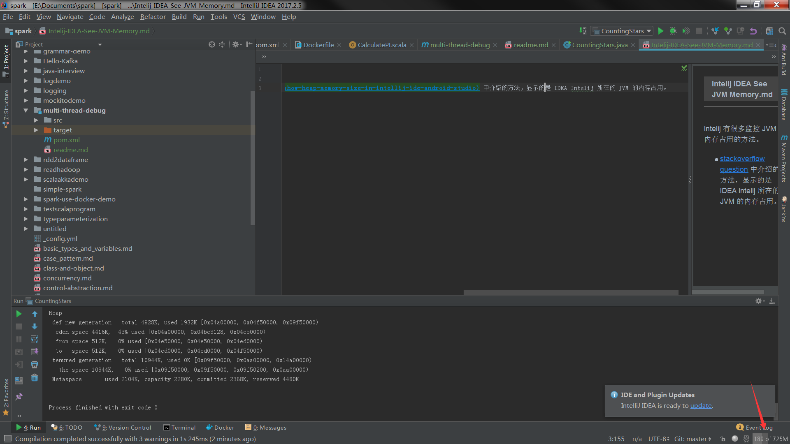

Intelij 有很多监控 JVM 内存占用的方法。

- [stackoverflow question](https://stackoverflow.com/questions/36691118/is-it-possible-to-show-heap-memory-size-in-intellij-ide-android-studio) 中介绍的方法，显示的是 IDEA Intelij 所在的 JVM 的内存占用。

- 可以给 JVM 拍快照。当运行或者 debug 程序时，点击照相机图标，就能得到该程序的快照。现在该程序的内存占用情况。

- Tools -> Capture Memory Snapshot 能够生成 *.hprof 文件，据说 eclipse 中的 MAT 工具可以查看这个文件。但是我在 Intelij IDEA 上，没有找到合适的 plugin 去查看 *.hprof 文件。

- 安装 JProfiler（被冠以 Java性能分析神器，感觉屌屌的）, 并且在 IDEA 上安装 jprofiler plugin, 就可以 profile 运行的代码，可以看出在程序运行的每一个时刻，程序占用的内存，cpu load, GC Activity 等等信息。 

- [JMeter 是个做压力测试的框架](http://jmeter.apache.org/)，你需要写 JMeter Test 才能使用 JMeter。它就好像是做压力测试的 junit。
