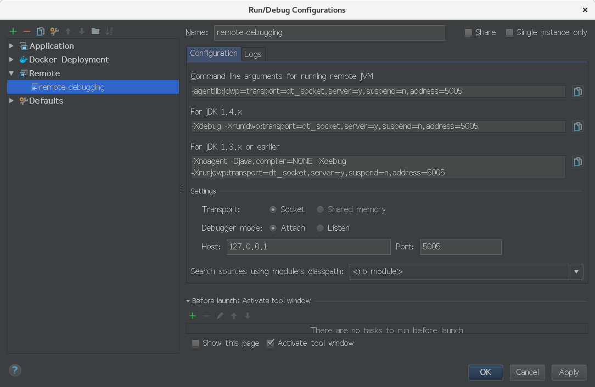

JVM 支持远程调试。

原理上参见[文章](https://docs.oracle.com/javase/7/docs/technotes/guides/jpda/conninv.html)。
这里主要说说这个 demo 怎么用：
- 运行 docker-compose up，启动 debug-container。
- 打开 MeetAndBye.java 文件，在 System.out.println("Good Bye"); 这一句前面点断点。
- 配置 remote-debugging run config, 具体配置如图



- 在命令行执行命令docker logs debug-container, 这时的日志是
```shell
Listening for transport dt_socket at address: 5005
```
这说明，Docker 正在等 debugger（在这个project 里, debugger 就是 remote-debugging） 去调试。

- 运行 remote-debugging ，会发现 docker logs debug-container 的日志变成
```shell
Listening for transport dt_socket at address: 5005
Nice to Meet you
```
这说明, docker 中的 JVM 执行到断点处停止执行了，这符合我的预期。


这个例子很小，但是很有意义，说明不光可以用 docker container 来进行集成测试，而且可以用 docker container 来做单元测试（调试程序）。
最后，JVM 远程调试，是 JVM jdpa 模块赋予 JVM 的功能，所有 JVM 只要启动时加载了 jdpa 相关的模块，都可以作远程调试。