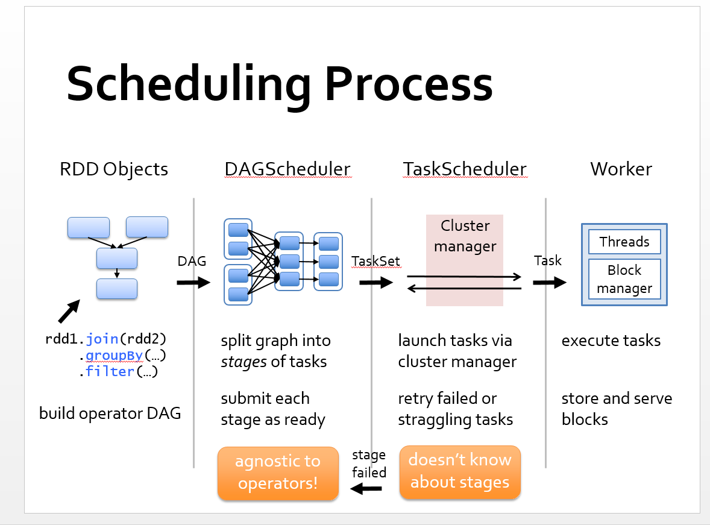
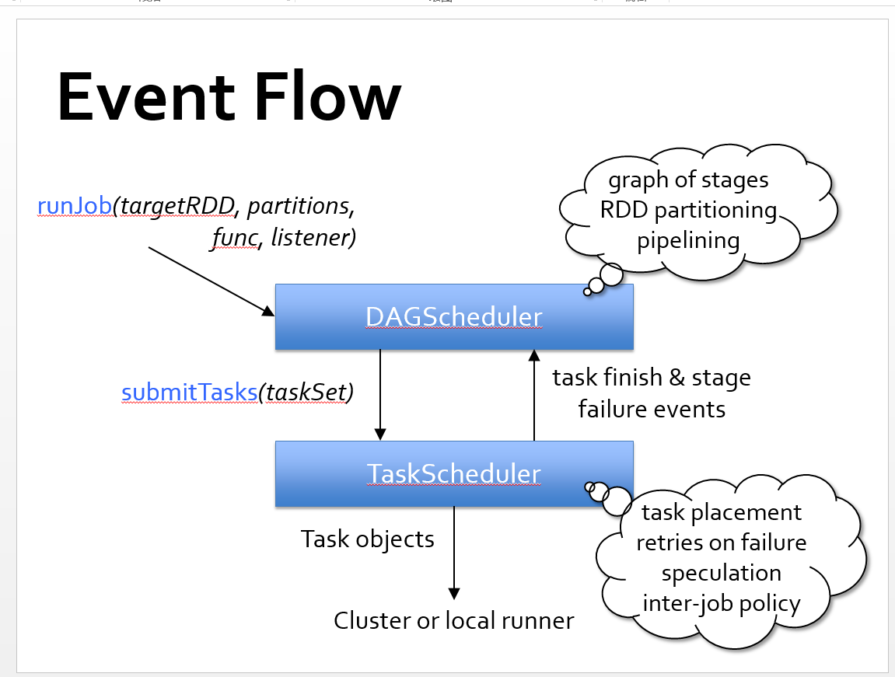

这是我读 spark 源码的笔记。

主要参考了[Apache Spark Source code walkthrough](https://www.alibabacloud.com/forum/read-471) 和
[Introduction to Spark Internals](http://files.meetup.com/3138542/dev-meetup-dec-2012.pptx)。
 

我认为 [Introduction to Spark Internals](http://files.meetup.com/3138542/dev-meetup-dec-2012.pptx) 中的插图非常清晰地描述
了 Spark 的内部机制。只可惜，单看这几幅图，没法理解 Spark 的内存管理。下面是我对这几幅图的理解。

通常写 Spark Application 能看到的就是 RDD Objects 这个部分。后面的 DAGScheduler, TaskScheduler 和 Worker 基本用不到。

SparkContext 类中的 runJob 方法，会调用 DAGScheduler 中的 submitJob 方法来执行后面三块的流程。

runJob 方法会把 RDD 传给 DAGScheduler ， DAGScheduler 根据 RDD， RDD 的依赖(Dependency) ， action 等创建 Stage（
DAGScheduler 类中有 createResultStage, createShuffleMapStage 方法）。DAGScheduler 负责把 Stage 整成 TaskSet, 再把 TaskSet
传递给 TaskScheduler， TaskScheduler 负责执行 Task，并向 DAGScheduler 反馈执行情况， TaskScheduler 会把 Task 分配到不同的
Worker 上执行， Worker 具体负责启线程执行等。 
 
作为 Spark 的使用者，我应该读读 RDD 的源码！！！

Spark Memory Model, spark 运行经常时不时报内存方面的问题，所以有必要看看 Spark 内存管理的源码！！！
